# GCPの最新AI×クラウドで切り開く次世代AIエージェント開発：目標達成特化型AIエージェント「Task Trail」

## 概要

本記事では、Zennで開催された「AI Agent Hackathon with Google Cloud」にて、筆者ら当チームが開発した**目標達成支援型AIエージェント「Task Trail」** を紹介します。Google が提供する最新の AI およびコンピューティング基盤を活用して開発した当アプリの特徴、開発背景・技術的ポイントや今後の展望についても解説します。

## はじめに

近年、ChatGPTやClaude、Geminiをはじめとする「生成AI」が注目を集めていますが、さらに一歩進んで「AI エージェント」というコンセプトが広がりつつあります。これは、自然言語を理解し、ユーザーからの多様なリクエストを柔軟に処理できるだけでなく、外部サービスと連携してタスクを実行できるAIを備えた仕組みです。

## プロジェクト概要

### 対象ユーザー像と課題

目標達成のためのマイルストーン管理に課題を抱える人や、日々のタスク管理が苦手な人が対象ユーザーです。例えば以下のような方々を想定しています。
- 英語学習や資格取得など、学習計画の立案・管理やモチベーション維持に課題を感じる人
- 社内のプロジェクトや、学校の文化祭などの大きなプロジェクトに関わり、タスク管理が必要な人
- ダイエットや学校の宿題などの日常の課題を管理して欲しい人

### 課題へのソリューション

上記課題に対し、本アプリのAIエージェントがタスク管理をサポートします。

具体的には、ユーザーが目標や仕事のプロジェクトを登録すると、目標達成のために必要なタスクの提案を AI エージェントが行います。たとえば「2025/8/31 までに TOEICで700点取得を目指したい」という目標を入力すると、AIが学習計画を立案し、具体的なタスクの作成を自動で行います。タスクは日々のTODOに細分化されてGoogleカレンダーに登録され、カレンダー上でのスケジュール管理や通知によるリマインダが可能です。また、カレンダーに登録する際は既存の予定を読み取り、ユーザーの忙しさに配慮した計画をたてることができます。進捗によってはタスクの調整や変更もできるため、無理なく目標達成できます。

### 特徴

このAIエージェントは従来のChatGPTやGeminiのようなユーザーと対話するAIに加え、Googleカレンダーを使った目標達成のためのタスクを可視化できることが特徴です。

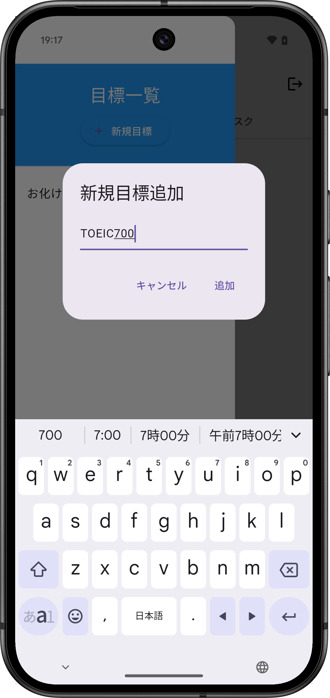
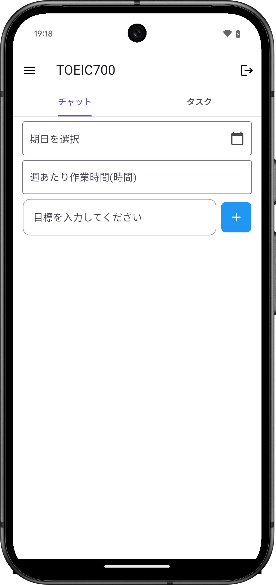

ユーザーは目標と、その期日や作業時間を入力します

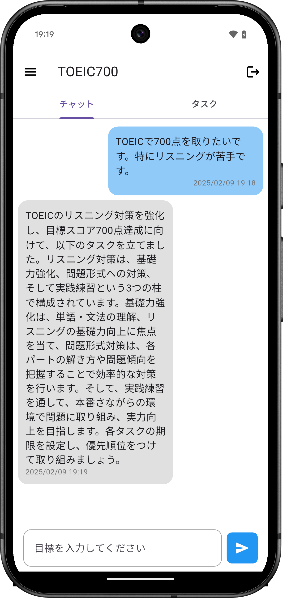
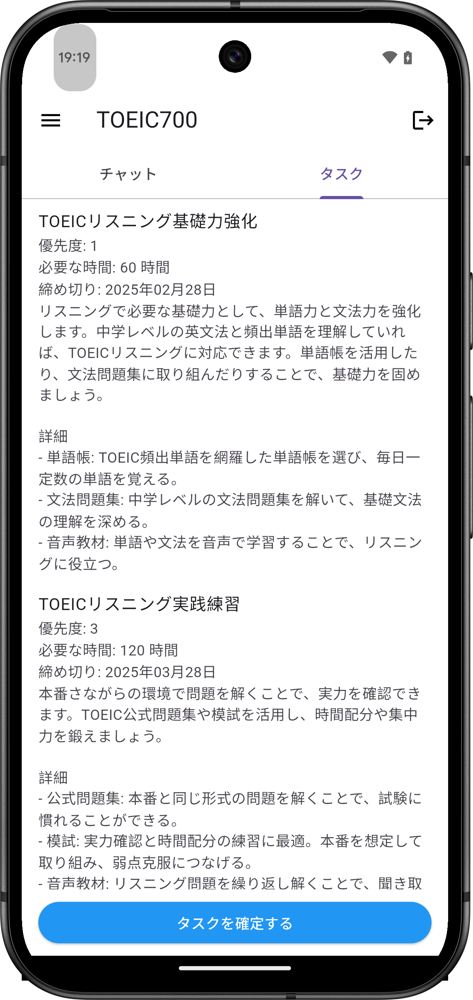

AIが目標を達成するためのタスクを切ってくれます。

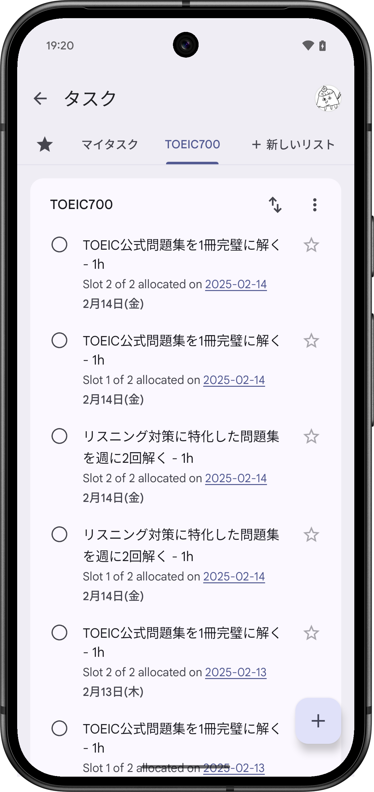
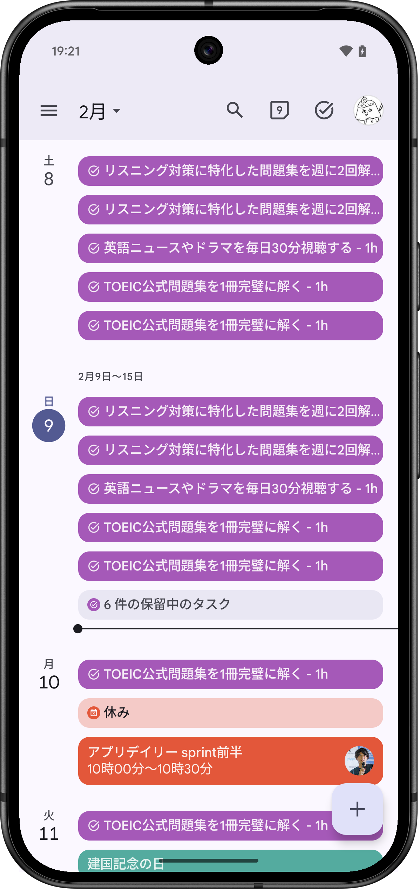

タスクを確定すると、AIがGoogleカレンダーを操作します。ユーザーの予定を鑑み、忙しさに配慮して日々のTODOの割当を行います。

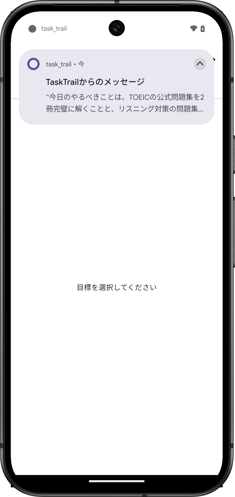

また、日々の通知で今日やるべきことを忘れないようにリマインドしてくれます。

### デモ動画

## 取り組んだ課題と解決策

1. **タスクの効率的な配分**

- **課題**: 毎日の忙しさにばらつきがある。例えば、MTGがギチギチの日もあれば割とフリーな日もある。そういった事情を考慮した動的な実行計画を立てたい。
- **解決策**: Google calendar APIから予定をロードしスケジュールの過密度を計算する。忙しい時期にはタスクを軽減するし、暇な日にタスクを集中させる都行った動的にスケジューリングを可能にした。

2. **AI 推論の処理負荷とコスト管理**

- **課題**: Vertex AI API への呼び出しが増えるほど、推論コストが上がりサービスとして成立しなくなる可能性がある。
- **解決策**: 推論結果の一部をDBにキャッシュし、頻出の問い合わせには再利用を行う。

3. **Groundingによる出力の品質向上**

- **課題**: LLMの出力信頼性の問題がある。実行計画を立てる上では、なるべく具体的かつ信頼性のある回答を返してほしい。
- **解決策**: LLMの出力にWeb検索のGrounding機能を付与することにより事実に即した出力を可能にし、ハルシネーションを防いだ。例えばこれに伴い、具体的な参考書の提示などが可能になる。

4. **権限管理の複雑化**

- **課題**: Firestore や カレンダー API など、複数 API を扱うため IAM 設計が複雑となる。
- **解決策**: サービスアカウントを用途ごとに分割し、必要最小限の権限の付与を行う。

## 技術的アーキテクチャと実装の詳細

### システム構成

以下が本プロジェクトのシステム構成図です。図の各要素について説明します。

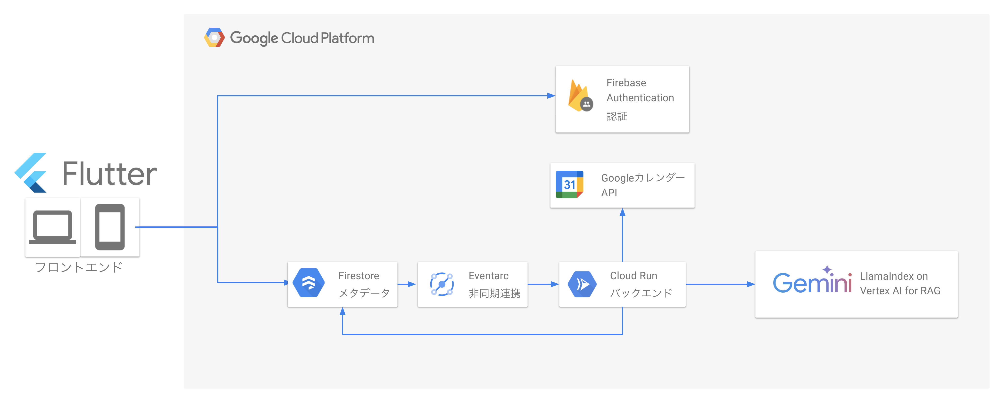

- **フロントエンド**: Flutter を使用したUI実装
- **認証**: Firebase Authentication によるユーザー認証
- **メタデータ**: Cloud Firestore API でのデータ管理
- **非同期連携**: EventArc による非同期イベント処理
- **バックエンド**: Cloud Run 上でホストされるサーバー
- **API**: Google カレンダー API との連携
- **AI基盤**: Vertex AI API (Gemini 1.5 Flash) による言語モデル

### 使用技術

開発に使用した主な技術スタックです：

#### プログラミング言語・フレームワーク
- **フロントエンド**: Flutter
- **バックエンド**: Python 3.11+
- **コンテナ化**: Docker / Docker Compose

#### クラウドサービス（Google Cloud）
- **コンピューティング**: Cloud Run
- **AI/ML**: Vertex AI API (Gemini 1.5 Flash)
- **データベース**: Cloud Firestore API
- **認証**: Firebase Authentication
- **イベント管理**: EventArc
- **外部API**: Google カレンダー API

#### 開発支援ツール
- **コミュニケーション**
  - Slack: チーム内連絡
  - Google Meet: オンラインミーティング
- **プロジェクト管理**
  - GitHub: コード管理
  - GitHub Issues: タスク管理
- **設計・計画**
  - Miro: ホワイトボード・システム設計
- **CI**
  - Github Actions

### フロントエンド（Flutter）
- **Flutter** 本アプリはFlutterで開発したことで、マルチOS、及びwebに対応しています。ユーザーはどのデバイスでも本アプリを使用可能です。もちろん異なるPF間でもデータは引き継がれます。

### バックエンド

- **Docker / Docker Compose** でアプリケーションをコンテナ化し、**Cloud Run** にデプロイ。
- **Vertex AI API (Gemini 1.5 Flash)** に問い合わせて学習計画の提案を生成。LLamaIndex を組み合わせることで、ユーザー固有のデータを取り込んだ RAG（Retrieval-Augmented Generation）を実装。
- **Google カレンダー API** ユーザーのスケジュールを読み取り、ユーザーの忙しさに配慮したスケジューリング管理を行います。
- **Firebase Authentication** で認証処理を行い、認可されたユーザーのみが学習目標やタスクを登録・管理できるように設定します。
- **Firestore** をデータベースとして扱います。ユーザーのチャット内容やタスク、TODOを格納します。
- **EventArc** でFirestoreへの書き込みを検知してバックエンドAPIをコールします。フロントエンドがバックエンドAPIを直接的にコールすることが不要となります。

## プロジェクト進行について

本ハッカソンでは1ヶ月弱の開発期間がありましたが、当チームのメンバーは5人で、バックグラウンドも日々の稼働時間もまちまちなメンバーが集結していました。そのため、一同に介してまとまった時間を取って開発するスタイルはできず、原則オンラインかつ非同期的な開発スタイルとなり、情報共有と進捗管理が課題でした。

この課題に対処するため、当チームではmiroを使い、アイデア出しからプロジェクトのゴール設定、システム設計、プロジェクト管理までの一連のフローを可視化しながらプロジェクト進行を行いました。このやり方によって、現在どこまでプロジェクトが進捗していて、各メンバーが何をする必要があるのかがわかりやすくなり、スムーズなプロジェクト進行をすることができました。

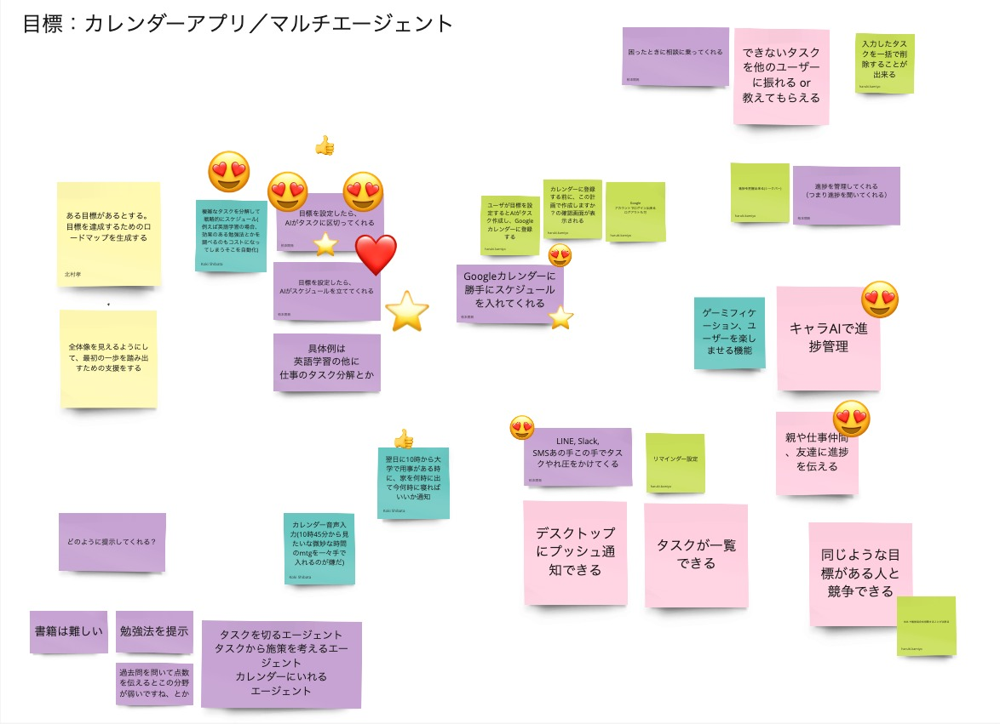

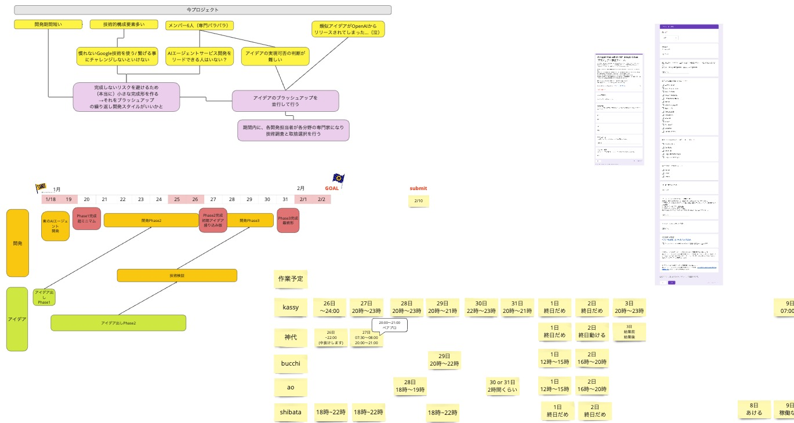

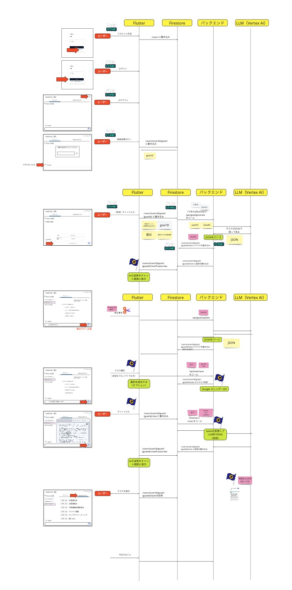

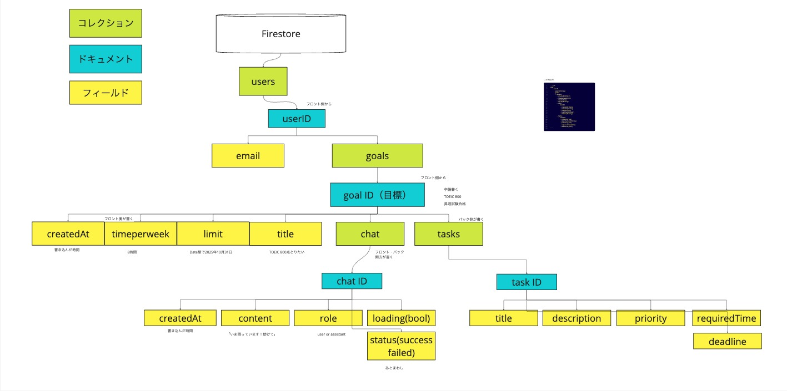

## ハッカソン参加の感想と学び（※内容は暫定）

- **短期間での開発プロセス**: ハンズオンやプレゼンを経て、最小限の MVP を素早く構築。
- **Google Cloud の支援体制**: チュートリアルやドキュメントが充実しており、初めてのサービスもキャッチアップしやすかった。
- **チームビルディングとコラボレーション**: Flutter の知見があるメンバーと、バックエンドに知見のあるメンバー、AI モデルに強いメンバーが協業しスムーズに分担できた。

## まとめ

今回のハッカソンでは、Docker / Docker Composeを使ったコンテナ化や、Cloud Runによるスケーラブルなデプロイ、Vertex AI API (Gemini 1.5 Flash) を活用した高精度の学習計画提案など、多彩なクラウド技術を組み合わせることで、短期間ながら次世代 AI エージェントのプロトタイプを構築できました。

### 今後の展望

今後の展望としては、下記のような機能強化案を実装することにより、より個々のユーザーに最適化した目標達成支援型AIエージェントに進化させることが可能と見込みます。

1. **タスク調整**: 進捗に従って柔軟にタスク調整してGoogleカレンダーに修正登録。
2. **外部サービス連携**: Google カレンダー以外のコラボレーションツールとの連動。
3. **コミュニティ機能**: 学習仲間との進捗共有や、目標達成を促す仕掛けづくり。

